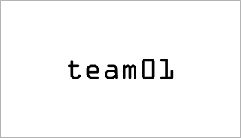

# MISSION GOAL : ESTABLISH IOT HUB COMMUNICATIONS

Azure IoT Hubs provide the low level communications between the devices in the space station on Mars and earth.

____

## CORE SKILL TRAINING

Before you can successfully communicate with the devices, you must first master core Azure IoT Hub skills.  To prepare, first complete the following two exercises:

> **Note**: Even if you are working in teams, it is recommended that each team member complete the core skill training exercises.  This will make sure that the entire team is ready to accomplish the Mission Objectives. 

1. Getting Started with Azure IoT Hubs (pick your preferred langauge):
    - C#: "[Get started with Azure IoT Hub for .NET](https://azure.microsoft.com/en-us/documentation/articles/iot-hub-csharp-csharp-getstarted/)"
    - Node.js: "[Get started with Azure IoT Hub for Node.js](https://azure.microsoft.com/en-us/documentation/articles/iot-hub-node-node-getstarted/)"
1. Sending Cloud-to-Device (C2D) Messages:
    - C#: "[How to send cloud-to-device messages with IoT Hub and .Net](https://azure.microsoft.com/en-us/documentation/articles/iot-hub-csharp-csharp-c2d/)"
    - Node.js: "[How to send cloud-to-device messages with IoT Hub and Node.js](https://azure.microsoft.com/en-us/documentation/articles/iot-hub-node-node-c2d/)"

    > **Note**: In the Node.js sample instructions you are told to install the `azure-iothub` npm package.  You must ALSO intsall the `azure-iot-common` npm package:
    
    ```text
    npm install azure-iothub --save
    npm install azure-iot-common --save
    ```

____

## MISSION OBJECTIVES

The main objective of this mission is to re-establish the IoT Hub communications with the space station.  You will be working as a part of a team on this objective.

Using this skills you mastered in the training, your next task is to accomplish the following objectives:

1. Retrieve your team number from Mission Control.
1. Monitor responses from the space station on your team specific consumer group.
1. Ping the communications module on the Space Station with your team number and verify a successful response.

### Retrieve Your Team Number

We need to coordinate the work of multiple teams in this lab.  You will need to contact a representative from Mission Control in the room to retrieve a card with your team name/number.  The card will look something like this:



The name displayed on your card "teamXX" is your team name.  You must use that name on all communications with the space station to prevent any issues.

## Ping the Communications module

To accomplish this objective you will need to modify the code you created in the core skill training exercises.  The communications module has been pre-configured to communicate with a specific IoT Hub.  It has also already been provisioned with a device identity in that hub.  Below, is a SAS Policy name and key you can use to connect to the IoT Hub with appropriate permissions for receiving messages from the communications module as well as being able to send messages to it.

| Item | Value |
| ---- | ----- |
| Mars Communication Module IoT Hub Device ID | marscomm |
| IoT Hub Host Name | udliot.azure-devices.net |
| SAS Policy Name | missionteam | 
| SAS Policy Key | p0Y+v1fdHDSASyrppHjQxJiTCN6WMqhgx9mEP+uueI4= |


